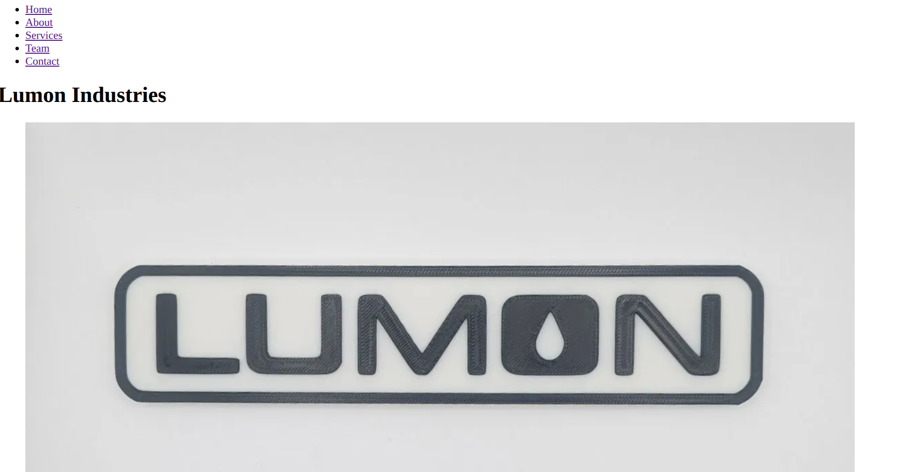

# Lumon Industries Webpage

This is a fictional website of Lumon Industries, that I made as part of the Week-1 Training's project requirement.
The webpage is built with all the things I have learned in the past 5 days with consistent navigations structure,
proper W3C validation passes and 90+ Lighthouse Accessibility on all pages. 

The website contains 5 pages as per the said tasks, and an additional page as mentioned in the daily challenge. It is currently hosted on GitHub pages and running [here](https://gaureshpa.github.io/Week1-Project/)

## Screenshot


*Screenshot of Homepage*

## List of Pages

This project consists of the following pages:

1. **index.html**: This page consists of a hero section, a three-column features section, and three testimonials.

2. **about.html**: This page consists of the company history, mission statement, values section with three articles and an address element with company's contact information.

3. **services.html**: This page consists of three service articles; each with a description list of features, and  call-to-action link. At the end it includes a comparison table of three services across ten criteria.

4. **team.html**: This page of consists of team member details from two departments with department name, employee name, employee role and employee bio.

5. **contact.html**: This page consists of a contact form with various user input and a field for message text. At the end of the page, there's an address section with an embedded Google Maps Link followed by the company's contact details such email and phone numbers.

6. **products.html**: This page consist of filterable data table of twelve products with a checkbox for in-stock items. Currently this page doesn't use any Javascript and is written in plain HTML.

## Technologies Used

- HTML5
- Inline CSS

## Local Installation Techniques

1. Clone the GitHub repository:
```bash
git clone https://github.com/gaureshpa/Week1-Project.git
```

2. Navigate into the project directory and open in VS Code:
```bash
cd Week1-Project
code .
```
3. Open with Live Server

